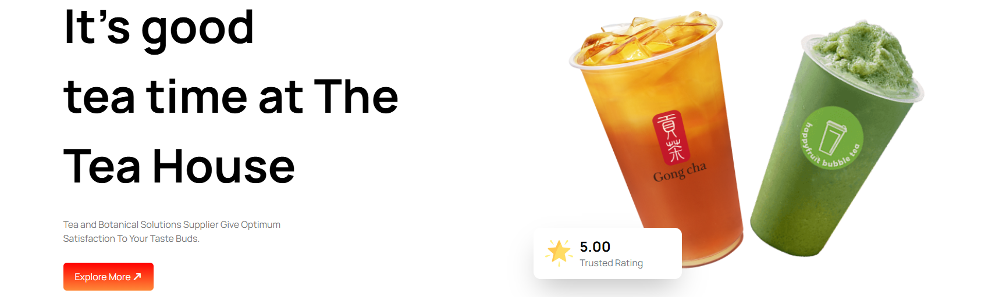
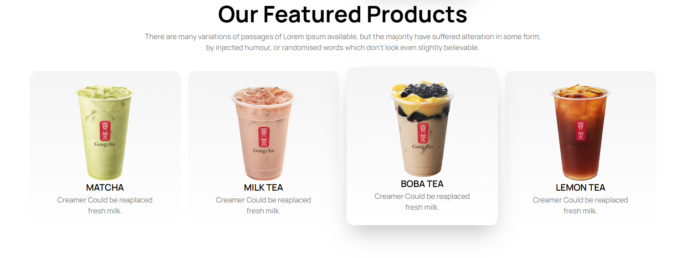
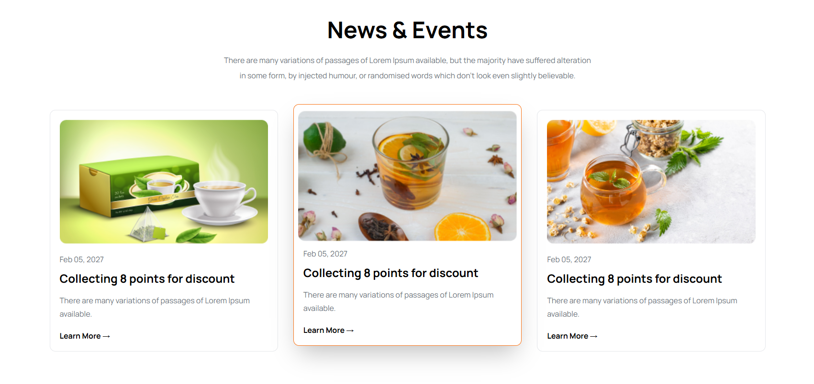
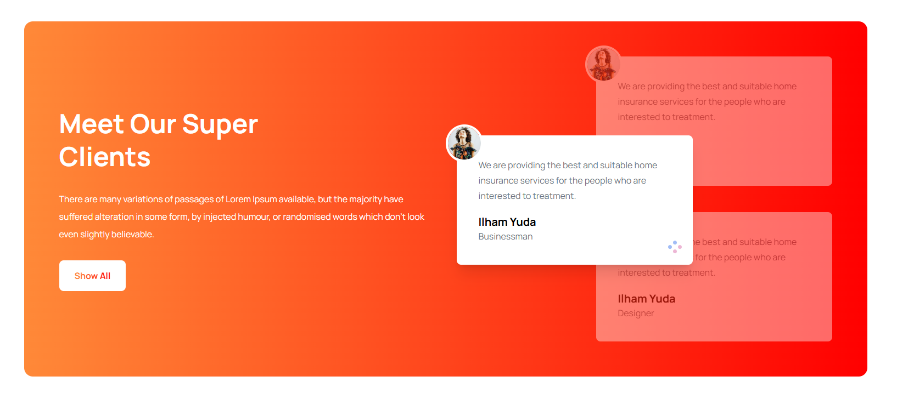

# 🍵 Tea House - Responsive Landing Page

A modern and responsive Tea House website built with **HTML5 and CSS3**.  
This project focuses on creating a visually appealing tea shop landing page with a clean user interface, responsive design, and structured frontend development practices.

---

## 🌐 Live Preview

🔗 **Live Website:**(https://sadats-loop.github.io/tea-house-website/)

---

## 📸 Project Screenshots

### 🏠 Hero Section



### 🍵 Featured Products



### 📰 Latest News Section



### ⭐ Testimonials Section



---

## ✨ Features

- ✅ Fully responsive design
- ✅ Modern tea shop landing page UI
- ✅ Attractive hero banner section
- ✅ Featured tea products showcase
- ✅ Customer testimonials section
- ✅ Latest news and updates section
- ✅ Clean navigation and footer design
- ✅ Mobile-friendly layout
- ✅ Organized and maintainable code structure

---

## 🛠️ Technologies Used

- **HTML5**  
  - Semantic website structure

- **CSS3**
  - Flexbox
  - Responsive layout
  - Custom styling
  - Media queries

- **Google Fonts**
  - Custom typography

- **Font Awesome**
  - Icons implementation

---

## 📂 Project Structure

```
Tea-House/
│
├── index.html
│
├── style.css
│
├── images/
│   └── Website assets
│
├── ss/
│   ├── hero-section.png
│   ├── products.png
│   ├── news.png
│   └── testimonials.png
│
└── README.md
```

---

## 🎯 Project Purpose

This project was developed to improve my frontend development skills by building a real-world website interface.

Through this project, I practiced:

- Creating responsive layouts
- Converting design ideas into code
- Working with CSS positioning and layouts
- Building reusable UI sections
- Improving frontend development workflow

---

## 📱 Responsive Design

The website is designed to provide a smooth experience across:

- 💻 Desktop devices
- 📱 Mobile devices
- 📟 Tablet devices

---

## 🚀 Future Improvements

Some features that can be added in future:

- Add JavaScript interactions
- Implement product filtering
- Add shopping cart functionality
- Connect with backend API
- Add user authentication system

---

## 👨‍💻 Author

**Sadat Ahmed**

Software Engineering Student  
Frontend Developer | MERN Stack Learner

### Connect With Me

- GitHub: Add your GitHub profile link
- LinkedIn: Add your LinkedIn profile link

---

## 🙏 Acknowledgement

This project was created as part of my frontend development learning journey with guidance from **Programming Hero**.

---

⭐ If you find this project helpful, consider giving it a star!
